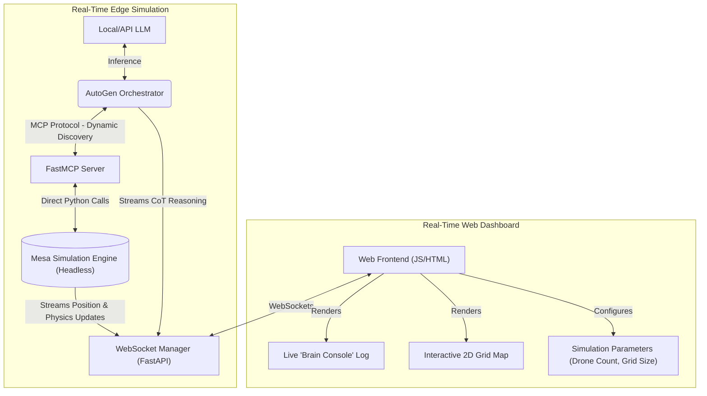
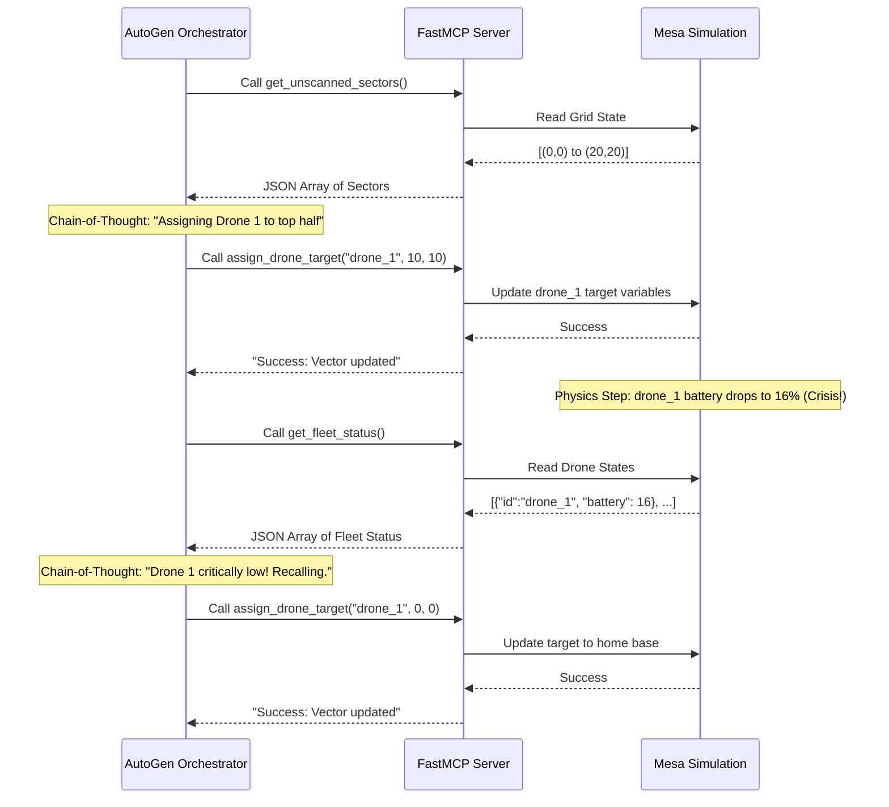

# Agile MVP Document: Decentralized Swarm Intelligence Prototype

<!--toc:start-->
- [Agile MVP Document: Decentralized Swarm Intelligence Prototype](#agile-mvp-document-decentralized-swarm-intelligence-prototype)
  - [1. Project Overview This document outlines the Minimum Viable Product (MVP)](#1-project-overview-this-document-outlines-the-minimum-viable-product-mvp)
  - [2. Software Requirements Specification (SRS)](#2-software-requirements-specification-srs)
    - [2.1 Core Objectives](#21-core-objectives)
    - [2.2 Functional Requirements](#22-functional-requirements)
      - [2.2.1 Simulation Engine (Backend - Mesa)](#221-simulation-engine-backend-mesa)
      - [2.2.2 The Bridge (Middleware - FastMCP)](#222-the-bridge-middleware-fastmcp)
      - [2.2.3 The Orchestrator (Cognitive Layer - AutoGen)](#223-the-orchestrator-cognitive-layer-autogen)
      - [2.2.4 Presentation Layer (Frontend - Streamlit)](#224-presentation-layer-frontend-streamlit)
  - [3. Software Design Document (SDD)](#3-software-design-document-sdd)
    - [3.1 Architectural Diagram (Mermaid)](#31-architectural-diagram-mermaid)
    - [3.2 MCP Tool API Contracts](#32-mcp-tool-api-contracts)
    - [3.3 The Golden Path Scenario (For Video Recording)](#33-the-golden-path-scenario-for-video-recording)
      - [Golden Path Sequence Diagram](#golden-path-sequence-diagram)
  - [4. Implementation Steps](#4-implementation-steps)
<!--toc:end-->

## 1. Project Overview This document outlines the Minimum Viable Product (MVP)

requirements and design for the Agentic AI (Decentralised Swarm Intelligence)
contest track. The prototype is explicitly optimized to meet the "Elite
Level" criteria of the judging rubric, prioritizing a flawless live
demonstration of LLM Chain-of-Thought reasoning, real-time Model Context
Protocol (MCP) tool discovery, and strategic resource optimization under the
simulation constraints defined in the case study. The system will feature a
fully interactive real-time web dashboard.

## 2. Software Requirements Specification (SRS)

### 2.1 Core Objectives

**Mission:** A central LLM Orchestrator must command a fleet of drones to
locate thermal anomalies (survivors) within a disaster zone while preventing
any drone from fully depleting its battery.

1. **Constraint 1 (Edge Operations):** The Orchestrator must use MCP to issue
   commands, simulating an environment where terrestrial networks have failed.
2. **Constraint 2 (Dynamic Discovery):** The Orchestrator must discover
   available drone assets at runtime via MCP; drone IDs must not be hardcoded
in the agent's prompt or primary logic loop.
3. **Constraint 3 (Agentic Reasoning):** The Orchestrator must output its
   logical Chain-of-Thought (e.g., explaining why it selected a specific drone
for a specific sector) before executing a tool.

### 2.2 Functional Requirements

#### 2.2.1 Simulation Engine (Backend - Mesa)

1. **Grid:** A discrete 2D spatial grid (e.g., 20x20) representing the
   operational area.
1. **Agents (Drones):** Minimum 3 simulated drone entities tracking their
   current `[x, y]` coordinates, `id`, and a decreasing `battery_level`
(0-100%).
1. **Targets (Survivors):** Minimum 2 static thermal anomalies placed randomly
   on the grid.
1. **Physics Loop:** A programmatic `step()` function that advances the
   simulation, degrading active drone batteries by a fixed percentage (e.g., 2%
per tick) and executing their assigned movement vectors.

#### 2.2.2 The Bridge (Middleware - FastMCP)

1. The system must expose Python functions as MCP tools.
1. The system must translate the LLM's JSON-RPC tool calls into direct function
calls that update the physical state of the Mesa Simulation Engine.

#### 2.2.3 The Orchestrator (Cognitive Layer - AutoGen)

- A single AutoGen agent initialized with a "Swarm Commander" persona.
- The agent must be configured to iterate through an observe-reason-act loop
until all grid sectors are covered or all targets are identified.

#### 2.2.4 Presentation Layer (Frontend - Real-Time Dashboard)

1. The UI must be a real-time web application (e.g., built with FastAPI
   WebSockets and React/Vanilla JS).
1. **Configuration Screen:** Allow dynamic injection of drones (3-5) and
   customization of grid size to prove the agent can handle real-time tool
discovery and unseen topologies, satisfying the "Masterclass Innovation" and
"Flawless Architecture" criteria.
1. **Live 2D Grid Visualization:** Display the drones, targets, and scanned
   sectors in real-time to demonstrate "Strategic Resource Optimization".
1. **Real-Time "Brain Console":** A live streaming log that displays the
   orchestrator's Chain-of-Thought *before* every action, satisfying the
"Profound Chain-of-Thought (CoT)" requirement.
1. The dashboard must visually prove the "Zero Battery Loss" guarantee by
   highlighting drones returning for simulated charging.

### 2.3 Use Case Driven Development & Personas

Drawing from industry best practices (PML 3-4 Prototype Validation), the system
development and live demonstration will be centered around a specific end-user
Persona to prove Human-Centered Design.

Persona: Commander Sarah (Incident Response Coordinator):

1. **Background:** A 45-year-old veteran disaster response commander operating
   from a mobile command center at the edge of the blackout zone.
1. **Pain Point:** She has no internet connection and cannot manually pilot
   multiple drones simultaneously. She needs a system she can completely trust
to operate autonomously.
1. **Expected System Response:** A clean, noise-free dashboard that requires
   minimal input (configuration only) and provides maximum transparency (Brain
Console) so she can trust the AI's resource management.

## 3. Software Design Document (SDD)

### 3.1 Context Diagram (System Boundaries)

To clearly define the scope and boundaries of the prototype, the system
functions within these bounds:

1. **Inputs:** Disaster Zone size, Initial Drone Count (from User/Sarah),
   Simulated drone coordinates & batteries (from Mesa).
1. **Processing:** Local LLM reasoning (AutoGen) to determine paths and tool
   calls via Model Context Protocol (MCP).
1. **Outputs:** Real-time visual tracking, Chain-of-Thought justifications, and
   alerts when survivors are found.

### 3.2 Architectural Diagram (Mermaid)

### 3.2 MCP Tool API Contracts

These are the exact tools the FastMCP server will expose to the AutoGen
Orchestrator. Strict typing and descriptions are essential to prevent LLM
hallucinations.

| Tool Name                 | Arguments                                                | Description                                                                           | Return Value Example                                    |
| :------------------------ | :------------------------------------------------------- | :------------------------------------------------------------------------------------ | :------------------------------------------------------ |
| `get_fleet_status()`      | *None*                                                   | Returns the current ID, spatial coordinates `[x, y]`, and battery % of active drones. | `[{"id": "drone_alpha", "pos": [1, 2], "battery": 88}]` |
| `get_unscanned_sectors()` | *None*                                                   | Returns a simplified list of grid coordinate areas that have not yet been surveyed.   | `[(5, 5), (10, 15), (18, 2)]`                           |
| `assign_drone_target()`   | `drone_id` (str) `target_x` (int) `target_y` (int) | Commands a specific drone to navigate to the target coordinates.                      | `"Success: Vector updated."`                            |
| `execute_thermal_scan()`  | `drone_id` (str)                                         | Activates the thermal sensor on a specific drone to scan its surrounding area.        | `"Anomaly Detected! Survivor logged at [x, y]."`        |

### 3.4 The Persona-Driven Scenario (For Live Demonstration)

The system must flawlessly execute this sequence during the live presentation
to max out the rubric score, framing the demo as a Use Case for our Persona:

1. **Live Initialization:** The presenter acts as Commander Sarah, starting the
   dashboard with 0 drones. Through the UI, 3 drones are dynamically injected.
The "Brain Console" logs the Orchestrator instantly discovering the new MCP
tools.
1. **Deployment:** The Orchestrator calls `get_unscanned_sectors()`, then
   explains its logic in the console to split the grid among the 3 drones using
Mathematical optimization concepts.
1. **The Crisis Event (Alternative Flow):** The presenter triggers a simulated
   battery drop on Drone 1 via the UI dashboard to simulate a hardware fault in
the field.
1. **Agentic Adaptation:** The Orchestrator instantly prints: *"Drone 1 is
   critically low. Recalling Drone 1 to base. Re-assigning Drone 2 to cover
Drone 1's sector."* This demonstrates to Sarah that the system is reliable
under stress.
1. **Success:** All sectors are scanned, 100% of survivors are logged, and 0
   drones are lost to battery drain.

#### Golden Path Sequence Diagram

## 4. Implementation Steps

1. **Backend Simulation Engine:** Create `simulation.py` with the robust Mesa
   grid, physics loop, and battery logic.
1. **MCP Middleware:** Build `mcp_server.py` using FastMCP to wrap simulation
   functions. Ensure dynamic registration logic is flawless.
1. **Cognitive Brain:** Implement `orchestrator.py` using AutoGen, enforcing
   strict Chain-of-Thought prompting before MCP execution.
1. **WebSocket API Layer:** Build `main.py` using FastAPI to serve the state of
   the simulation and the agent's logs over WebSockets.
1. **Elite Web Dashboard:** Develop the frontend UI (HTML/JS/CSS) featuring the
   configuration panel, the live 2D grid canvas, and the streaming "Brain
Console" to hit the final presentation requirements.
